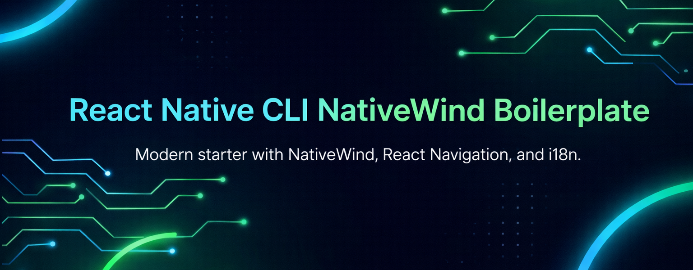

<div align="center">
  
  <h1>React Native CLI NativeWind Boilerplate</h1>
  <p>Modern, minimal React Native CLI starter with NativeWind, React Navigation, and i18n built in.</p>

  <p>
    <a href="https://github.com/zumrakb/reactnativecli-nativewind-boilerplate/stargazers">
      
    </a>
    <a href="https://github.com/zumrakb/reactnativecli-nativewind-boilerplate">
      
    </a>
    <a href="https://github.com/zumrakb/reactnativecli-nativewind-boilerplate">
      
    </a>
    <a href="./LICENSE">
      
    </a>
  </p>
</div>

## Overview
This boilerplate helps you start fast with a clean architecture, a modern UI baseline, and the essential tooling already configured.

If you like it, give it a star or leave a comment. It truly helps.

## Features
- ✅ React Native CLI with TypeScript
- 🎨 NativeWind (Tailwind CSS for React Native)
- 🧭 React Navigation with bottom tabs preconfigured
- 🌍 i18n with persistent language selection
- 🧩 Vector icons ready for tabs and UI
- 💾 AsyncStorage for local key-value storage
- ✨ Clean, minimal folder structure

## Requirements
- Node 20+ (recommended)
- Android Studio for Android
- Xcode for iOS (macOS only)
- Java 17 (for Android builds)

Also install the React Native CLI dependencies from the official React Native environment setup (Quickstart tab).

## Quick Start
```bash
git clone https://github.com/zumrakb/reactnativecli-nativewind-boilerplate.git
cd reactnativecli-nativewind-boilerplate
npm install
```

### Android
```bash
npm run android
```

### iOS
```bash
cd ios
pod install
cd ..

npm run ios
```

## Development Workflow
Start Metro in a separate terminal for faster iteration:
```bash
npm start
```

Then in another terminal:
```bash
npm run android
# or
npm run ios
```

## Project Structure
- `src/navigation/` navigation setup and tab bar
- `src/screens/` app screens
- `src/i18n/` translations and i18n setup
- `global.css` NativeWind styles
- `App.tsx` app entry

## Styling (NativeWind)
NativeWind is configured, so you can style components using Tailwind utility classes via `className`.

## Navigation
React Navigation is set up with a bottom tab bar. You can add new screens in `src/screens` and register them in `src/navigation/AppNavigator.tsx`.

## Localization (i18n)
Language selection is built in and persisted using AsyncStorage. Update translations in `src/i18n/translations`.

## App Preview
Replace the banner in `src/assets/banner.png` with your own image if needed.

## Troubleshooting
- If Android fails to merge assets after running `npx react-native-asset`, remove duplicate fonts in:
  `android/app/src/main/assets/fonts`
- If Gradle caches are corrupted, remove `.gradle/caches` and rebuild.

## Contributing
PRs and suggestions are welcome. If you build something cool with this boilerplate, feel free to share it.

## License
This project is licensed under the MIT License. See the `LICENSE` file for details.
